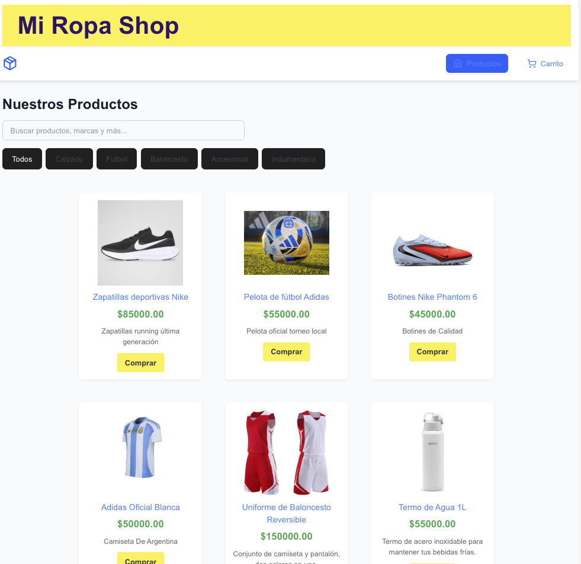

# 🛍️ E-Commerce con React y Vite

  
> 💡 `./public/demo.png`

---

Este proyecto es una **entrega final** del curso de **React** en **Talento Tech**, desarrollado por **Alejandro Ponce**.

Se trata de una aplicación de **e-commerce** construida con **React**, utilizando **Vite.js** para un entorno de desarrollo rápido y eficiente.

Actualmente, el proyecto está **conectado a un backend propio desplegado en Vercel**, el cual se encarga de gestionar productos, usuarios y operaciones principales.  
Además, utiliza **Firebase** como **base de datos en la nube**, garantizando persistencia y sincronización en tiempo real.

El proyecto está desplegado en:  
👉 https://preentrega-alejandro-ponce.vercel.app/ — ¡Podés probarlo ahora!

**Credenciales de prueba:**  
- Usuario: **admin**  
- Contraseña: **1234**

---

## 🚀 Tecnologías utilizadas

- ⚛️ **React** – Librería principal para construir la interfaz.  
- ⚡ **Vite.js** – Entorno de desarrollo ultra rápido.  
- 🌐 **React DOM** – Manejo del DOM y renderizado eficiente.  
- 🔗 **Backend en Vercel** – API real desarrollada y alojada en Vercel.  
- 🔥 **Firebase** – Base de datos en la nube para almacenamiento persistente.  
- 🌐 **MockAPI** – Inicialmente utilizado para simular operaciones CRUD durante el desarrollo.  

---

## 📦 Características principales

- 📋 Listado dinámico de productos obtenidos desde el backend en Vercel.  
- 🛒 Sistema de carrito de compras.  
- 🔍 Filtrado y visualización de productos.  
- 🧭 Navegación con React Router DOM.  
- 🔐 Sistema de login de usuarios conectado al backend y Firebase.  
- 💅 Estilos personalizados (CSS Modules / Tailwind, si aplica).  

---

## ⚙️ Instalación y uso

1. **Clonar el repositorio**  
   ```bash
   git clone <repo>
